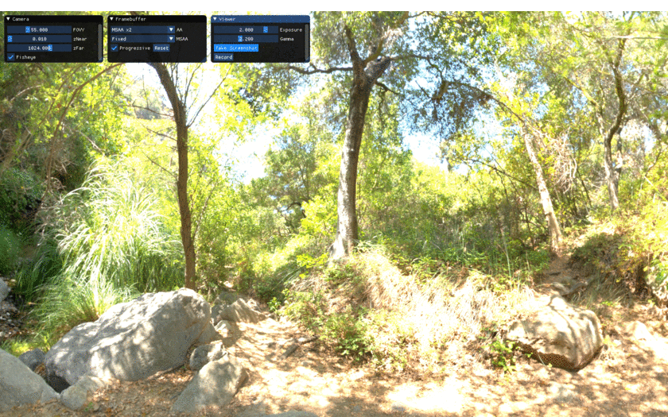

## Fisheye Projection Demo

This code compares the fisheye projection with the conventional perspective projection
by rendering an HDR cubemap.

Compared to the perspective projection, the fisheye projection is conformal, i.e., 
any 3D spherical objects remains spherical in screen space. It also behaves much 
better for wide field of views.

I got inspired to do this demo after seeing this cool quake mod: http://strlen.com/gfxengine/fisheyequake/

