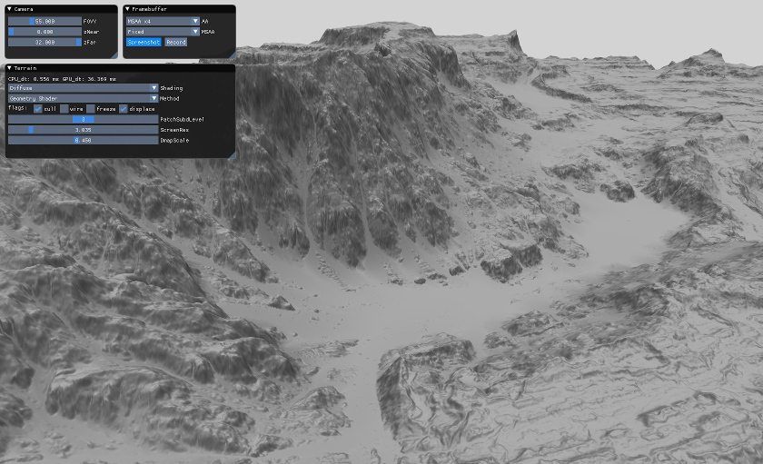

# Implicit Subdivision on the GPU

## License
This code is public domain.

## Details
This demo provides additional implementations for the article 
"[Adaptive GPU Tessellation with Compute Shaders](http://onrendering.com/data/papers/isubd/isubd.pdf)" by 
[Jad Khoury](https://github.com/jadkhoury), 
[Jonathan Dupuy](http://onrendering.com/) (myself) and 
[Christophe Riccio](https://github.com/g-truc); 
the paper is available on my website: <http://onrendering.com>.

Many thanks to [Cyril Crassin](https://twitter.com/Icare3D) (from NVIDIA) for 
helping me putting this demo up (the mesh shader pipeline exists thanks to 
his help). 

Specifically, the demo renders a terrain with an adaptive mesh that is handled entirely on the GPU. The adaptive mesh is built from an implicit representation that works similarly to a binary tree, which can undergo up to 31 subdivisions (this exceeds by far the capabilities of current GPU tessellation units, which are limited to 6 levels). Each node of the tree is further triangulated with a constant tessellation factor that can be modified by the user. Our code can achieve this via 4 different rendering techniques:

* *Compute Shader* -- Similar to that of the original article; original demo available here: https://github.com/jadkhoury/TessellationDemo.

* *Tessellation Shader* -- Single-pass rendering with tessellation shaders; the tessellation control shader produces the triangulation at each node of the implicit binary tree (via *fixed* tessellation factors).

* *Geometry Shader* -- Single-pass rendering with a geometry shader; the geometry shader produces the triangulation at each node of the implicit binary tree.

* *Mesh Shader* -- Single-pass rendering with a task and mesh shader (Turing GPUs only); the mesh shader produces the triangulation at each node of the implicit binary tree.

The demo loads a 16-bit displacement map and allows the user to play with the subdivision parameters.
This source code is released in order to facilitate adoption by developpers.

## Some Notes for Performance Comparisons
The user can interactively change the rendering pipeline at run-time and see how performance scales. Please do keep in mind however:  
* We did not extensively optimize the rendering pipelines: We believe that our algorithms can be made faster with careful optimization. This demo is meant to provide the algorithms to implement a fast terrain renderer, but we leave it up to the developper to make it run optimally on the platforms they target. 
* The tessellation shader pipeline produces more triangles than the other pipelines: Although all rendering pipelines target the same polygon per pixel density, the tessellation produced by the tessellation shader pipeline produces more triangles than the other pipelines. This is because GPU tessellation units have a fixed, hardware accelerated triangulation algorithm that differs from the one we use in the other rendering pipelines. This is something to keep in mind if rasterization becomes the bottleneck.

